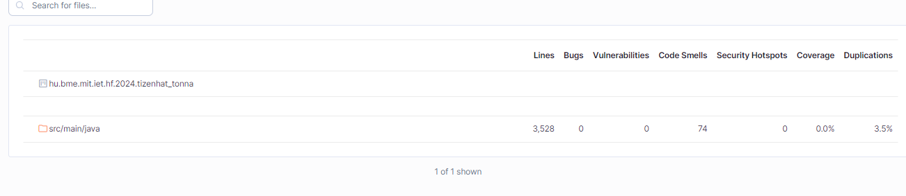

# Statikus és manuális ellenőrzés
## Eszközök
* Manuális ellenérzés IntelliJ környeztben
* SonarLint plugin használatával
* SonarCloud segítségével

## Tevékenység
* Első lépés a kódbázis megismerése és futtatása volt.
* Második lépés a Sonar rendszerrel való összektése a projektnek. Ekkor még nem jelentek meg az issuk a felületen, azt csak később sikerült megoldani a projektstuktúra megváltoztatásával.
* Következő lépés a néhány feltűnő hiba javítása ami a kódbázis megismerése közben feltűnt.
* Ezt követően több lépésben a SonarLint segítségével a különböző issukat javítottam. Nem minden került javításra, például a pacakgek nevei, illetve a tervek szerint megvalósított propertyk publikusak maradtak, mivel a getterek és setterek nem valósítanának meg egyéb funkciót a változók beállítása és visszaadásán kívül.
* A végső lépés a SonarCloud segítségével részletsebb vizsgálat és javítás. A program használt random szám generálást, ami nem egy játék környezetben seed nélkül biztonsági kockázat lenne, de itt elhanyagolható. Ezen kívül a duplikált kódsorok számát is csökkentettem, továbbá olyan issukat is javítottam amit nem jelett a SonarLint.

## Illusztáció
### Javítások előtt

### Javítások után

