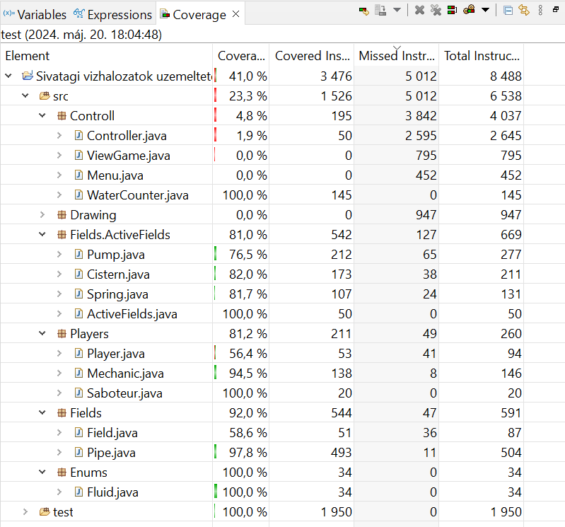

# Egységtesztek készítése/kiegészítése + tesztek kódlefedettségének mérése és ez alapján tesztkészlet bővítése - Dokumentáció

Jelen fájl a választott projekthez készült Unit tesztek dokumentálására szolgál.

## Tesztelt osztályok

A játék azon osztályait teszteltem, melyek nem a grafikus megjelenítéshez tartoznak. Hét darab ilyen osztályt tartalmaz a projekt, melyek (a hozzájuk készített teszt osztályokkal) a következők voltak:

- WaterCounter.java -> WaterCounterTest.java
- Cistern.java -> CisternTest.java
- Pump.java -> PumpTest.java
- Spring.java -> SpringTest.java
- Pipe.java -> PipeTest.java
- Mechanic.java -> MechanicTest.java
- Saboteur.java -> SaboteurTest.java

Minden tesztelt osztály minden függvényéhez készítettem legalább egy tesztet, figyelve arra, hogy az összes fontos esetet lefedjem ezekkel.

## Unit tesztek

A tesztek elkészítéséhez JUnit-ot használtam. Minden tesztelt osztályhoz egy külön tesztfájlt készítettem, melyben minden függvénynek dedikáltam legalább egy önálló tesztet a Unit tesztelés elveinek megfelelően. A feladat elvégzése során összesen 69 darab tesztet írtam. Ezek mindegyike jól lefut és a várt eredményeket adja.

## Tesztlefedettség

A JUnit segítségével a lefedettséget is tudtam mérni. Egy-egy futtatás után a lefedett részek zölddel, a nem lefedettek pirossal, a részben lefedettek pedig sárgával kerültek kiemelésre. Ez segített a megfelelő tesztelésben. Első körben törekedtem arra, hogy a tesztelt osztályok minden függvényéhez legyen egyetlen jól működő tesztem. Már ez is nagy kódlefedettséget eredményezett, de ezután a komplexebb és fontosabb függvények további, eddig kimaradt aleseteihez is írtam teszteket. Ezzel minden tesztelt osztály lefedettsége 80-90% körülre emelkedett, valahol a 100%-ot is eléri.

A lefedettségek az alábbi ábrán tekinthetőek meg:

Látható, hogy a tesztelt osztályok lefedettsége mindenhol elég nagy:
- WaterCounter.java: 100%
- Cistern.java: 82%
- Pump.java: 76,5%
- Spring.java: 81,7%
- Pipe.java: 97,8%
- Mechanic.java: 94,5%
- Saboteur.java: 100%