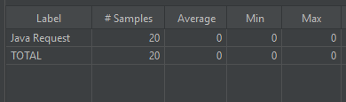

# Nem funkcionális elemek tesztelése
A tesztelés során a vízvezeték-játék nem-funkcionális jellemzőit vizsgáltam. Ez a teljesítmény, stresszbírás, biztonság és használhatóság vizsgálatát foglalja magában. A tesztelés megvalósítása során a legnagyobb nehézséget talán annak a kitalálása okozta, hogy hogyan implementáljam a tesztelő osztályt úgy, hogy a lehető legminimálisabban zavarja meg a létező kódot. A végső megoldás az lett, hogy pár változót statikussá kellett tenni, hogy a külön tesztosztályból elérhetők legyenek.

## Teljesítmény
### Indítási idő mérése
Ezt külső alkalmazás használata nélkül mértem le, tisztán a kódból, az egyszerűbb megvalósítás érdekében. 20 mérést végeztem, amiknek az eredménye az lett, hogy az indítási idő jellemzően 43 ± 1ms (99%-os konfidenciaintervallummal számolva).

### Válaszidők mérése
Itt azt mértük, hogy a játék milyen gyorsan reagál adott felhasználói inputokra. Itt három olyan inputot találtam, amit úgy gondoltam, érdemes mérni: a megjelenítés témáját változtató gomb, a játékot elindító gomb, illetve a játék menete során nyomható "akciógombok". Ezeket a méréseket már a JMeter segítségével végeztem, a képeken annak a kimenetei láthatók.

#### Dark Mode gomb

Itt a válaszidő érthető módon azonnali volt - hiszen nem futtat a gomb semmi logikát, számítást, csak módosítja GUI elemek színét. Így tehát a mérések közül egyik sem érte el az 1ms-ot.

#### Játék Indítása gomb

A mért válaszidők közül messze ez volt a legjelentősebb - ismét érthető módon, hiszen itt történik a pálya beolvasása, létrehozása, a játékosok inicializálása, és az új GUI ablak létrehozása is.

Az így kapott jellemző játékindítási idő tehát nagyjából 116 ± 6ms (szintén a 99%-os konfidenciaintervallummal számolva, a mért átlag és szórás alapján).

#### Akciógombok

Itt ahelyett, hogy a gombokat egyesével mérném, egyszerre 5 gomb egymás utáni megnyomására mértem a válaszidőt, aminek az adatai a mellékelt képen láthatók. Ezt átszámoltam egy egyéni gombnyomásra vonatkozó értékre, ami szerint a jellemző válaszidő egy gombnyomásra 1 ± 0.36ms (ismét 99%-os konfidenciaintervallummal számolva).

## Stresszteszt
### Erőforrás-használat mérése

Ezekhez a mérésekhez a VisualVM szoftvert használtam, ami kifejezetten a Java alapú alkalmazások erőforráshasználatának mérésére készült. Ezen felül ezek a tesztek szintén a JMeter-ből lettek indítva, mert a terhelés során szimulált inputok azon keresztül lettek lekódolva.

#### Készenléti állapotban

Vagyis amikor a játék a játékos inputjaira vár, és ezen felül más nem történik. Mint ahogy az várható volt, a CPU terhelés ilyenkor nulla, vagy majdnem nulla. A felhasznált memória stabilan 323 MB környékén van

#### Stresszteszt során

Ugyan az eredmény itt jelentősen más, mint az előbb, érdemes kihangsúlyozni, hogy egy lehetetlenül intenzív inputáradatot kellett szimulálni ahhoz, hogy a program erőforráshasználata jelentőssé váljon. Tehát a valóságban, rendes használat során az ehhez hasonló terhelés létrejötte lehetetlen. A terheléshez folyamatos gombnyomásokat szimuláltam, 1ms-os várakozásokkal a nyomások között. A CPU használat így (egy kezdeti ugrás után) 5% körül stabilizálódott, a memóriahasználat pedig 50 MB és 625 MB között mozgott.

### Skálázhatóság

A skálázhatóságot egyetlen módon tudtam mérni, ez pedig a pályák mérete. A többi aspektusa a játéknak nem skálázható (több játékos esetében is egyszerre mindig csak egyvalaki léphet). Öt esetet mértem, az alapértelmezett pálya méretével kezdve, és kettesével növelve a pálya méretének szorzóját (tehát az 1-9x méreteket, kettesével). Az 5x méretű pálya betöltési ideje például ez:

Az összes képet egyesével nem fogom beszúrni, hanem egy grafikonban összeszedve mutatom meg a skálázódást:

Az adatokból elég tisztán látszik, hogy egy lineáris összefüggésről beszélünk a bemeneti pályaméret és a betöltési idő között.

## Biztonság

### Input validáció

A tesztelés további része manuálisan történt, nem dedikált programokkal. A programban három típusú input lehetséges. Ezek a legördülő menük, a gombok, és a kattintható térkép.

A legördülő menüben és a kattintható térképen biztonságra veszélyes, vagy csalásra használható inputot nem találtam.

#### Nyomható gombok

Egyedül egy bizonsági problémát találtam az inputokkal kapcsolatban. Játék közben, amennyiben szabotőr van soron, és egy csővezetéken tartózkodik, a "Put Down Pipe" akció egy futásidejű hibát okoz.

Ezen felül volt még egy kozmetikai probléma, ami akkor áll elő, ha egy térképre kattintást igénylő lépést kezdeményezel, de utána ehelyett egy másik, ezt nem igénylő lépésre váltasz. Ilyenkor a képernyőn ragadhatnak a térképre kattintás GUI elemei, és egész addig nem tűnnek el, amíg valaki egy ilyen lépést végre nem hajt.

## Használhatóság

### Felhasználói felület

Ez a rész arra fókuszál, hogy kap-e a felhasználó elegendő és érthető visszajelzést a lépéseiről és azok kimeneteléről, illetve hogy mennyire felhasználóbarát a játék kezelőfelülete. Az első részre a válasz vegyes. Arról kapunk egyértelmű visszajelzést, hogy a lépésünk sikeres volt-e, vagy sikertelen, de az indoklás, hogy miért, azt nem látjuk semmilyen visszajelzésben.

Ezen kívül egy feltűnő hiányosság, hogy a játék vége után nincs mód visszatérni a főmenübe, és egy új játékot kezdeni. Ez csak a program újraindításával lehetséges.

### Tanulhatóság

Itt a kérdés az, hogy milyen könnyen sajátítható el a játék. Az alapvetően intuitív, hogy a különböző inputok mit csinálnak, viszont a játék leírásához nincsen beépített súgó, ez csak a dokumentációban van részletesen leírva.

### Kiegyenlítettség

Az utolsó szempont pedig az, hogy mennyire könnyű kiegyenlítetlen játékhelyzetet előállítani. A dokumentációban le van írva, hogy a két csapat játékosainak száma között maximum 1 legyen az eltérés, viszont ez a programban semmilyen módon nincs beépítve. Nincs figyelmeztetés vagy blokkolás, ha ennek nem megfelelő beállításokkal indítasz el egy meccset.